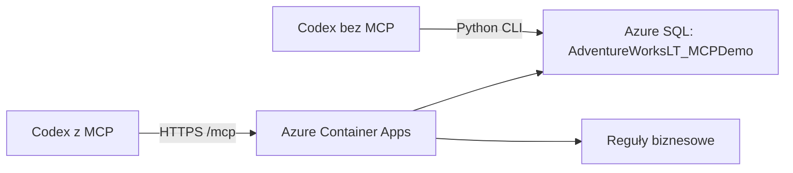

# SQLDay: AdventureWorksLT + MCP + Codex

Mały serwer MCP w Pythonie: agent poznaje schemat i reguły biznesowe, a następnie sam pisze SQL.
Serwer udostępnia **3 narzędzia** (`get_schema`, `get_business_rules`, `query_sql`) i zasób
`adventureworks://business-rules`. Nie wymaga własnego modelu ani klucza OpenAI.



## Co jest w repozytorium

| Element | Przeznaczenie |
|---|---|
| `app/server.py` | Kod pokazywany na scenie: dekoratory, narzędzia, zasób, HTTP i Bearer |
| `app/database.py`, `app/sql_policy.py` | Wspólny odczyt SQL, metadane, limity i walidacja |
| `app/sql_cli.py` | Dostęp do tej samej bazy bez MCP |
| `MCP instrukcje.md` | Jedno źródło reguł; wersja to skrót SHA-256 treści |
| `presenter/` | Prywatne przygotowanie danych i weryfikacja odpowiedzi |
| `infra/`, `scripts/` | Bicep, wdrożenie, firewall, smoke test i eksport stanowisk |
| `docs/demo.md` | Scenariusz 25–30 minut i tabela do trzech prób |

**Nie uruchamiaj pojedynku w tym repozytorium.** Zawiera odpowiedzi, dane seed i zapytania
referencyjne. Eksportuj osobne stanowiska zgodnie z instrukcją poniżej. `.dockerignore` działa
jako lista dozwolonych plików. Skrypt wdrożenia dodatkowo kopiuje tylko nazwane pliki aplikacji
do osobnego katalogu tymczasowego i przekazuje ten katalog do ACR. Dzięki temu Azure CLI nie
przegląda lokalnych cache, sekretów ani materiałów prowadzącego. Katalog jest usuwany po budowaniu.

## 1. Wymagania

Na Windows domyślna polityka PowerShell może blokować wszystkie pliki `.ps1`.
Przed uruchomieniem skryptów z tego repozytorium dopuść lokalne skrypty **tylko w bieżącym terminalu**:

```powershell
Set-ExecutionPolicy -Scope Process -ExecutionPolicy RemoteSigned -Force
```

Zmiana wygasa po zamknięciu terminala i nie wymaga administratora. Jeśli politykę narzuca
organizacja (`MachinePolicy` lub `UserPolicy` w `Get-ExecutionPolicy -List`), ustawienie
sesji jej nie nadpisze. [Dokumentacja Microsoft](https://learn.microsoft.com/en-us/powershell/module/microsoft.powershell.core/about/about_execution_policies)

- Python 3.12 i `uv`; wersje pakietów są zapisane w `uv.lock` (MCP SDK **2.2.0**).
- Microsoft **ODBC Driver 18 for SQL Server**, w architekturze interpretera Python
  (na Windows ARM z Pythonem x64 instaluj sterownik x64).
- Do Azure: Azure CLI, uprawnienia do wdrożeń, SQL i przypisania `AcrPull` w grupie zasobów.
- Do inspektora: Node.js z `npx`. Docker Desktop jest opcjonalny — Azure ACR potrafi budować obraz.

```powershell
uv sync --frozen
uv run --frozen pytest -q
uv run --frozen ruff check .
uv run --frozen ruff format --check .
```

Bez `AW_RUN_SQL_TESTS=1` testy prawdziwej bazy są pomijane. Pozostałe testują walidację SQL,
limity, maskowanie błędów, transport MCP, uwierzytelnienie i izolację materiałów demo.

ODBC: [instalator Windows](https://learn.microsoft.com/en-us/sql/connect/odbc/download-odbc-driver-for-sql-server),
[instalacja Linux](https://learn.microsoft.com/en-us/sql/connect/odbc/linux-mac/installing-the-microsoft-odbc-driver-for-sql-server).
Obraz kontenera instaluje sterownik automatycznie.

Skrypty Azure automatycznie wykrywają launcher CLI i korzystają z jego pełnej ścieżki.
Obsługują również instalację przez `uv tool install azure-cli`, której skrót `az.bat`
może trafiać na alias Pythona ze sklepu Windows. Aby naprawić także ręczne polecenia
`az` w bieżącym terminalu, uruchom `scripts/Use-AzureCli.ps1`.

## 2. Przygotowanie pustej grupy Azure

Ustalona subskrypcja: `f2515b68-6632-4afd-b4cc-7f7808fca36d`.
Grupa: `sqldaylite-demo-rg`. Skrypt odczytuje region istniejącej grupy. Nazwa serwera SQL jest
deterministyczna i zawiera sufiks zależny od subskrypcji i grupy.

```powershell
az login
az account set --subscription f2515b68-6632-4afd-b4cc-7f7808fca36d

# Sekrety losowe, bez wypisywania wartości. Windows zapisuje lokalną kopię zaszyfrowaną DPAPI.
.\scripts\Initialize-Secrets.ps1 -IncludeAdmin

# Wstaw publiczny IPv4 stanowiska; VPN może zmieniać adres wyjściowy.
$presenterIp = '<publiczny IPv4>'
.\scripts\New-DemoDatabase.ps1 -PresenterIPv4 $presenterIp

# AW_SQL_SERVER ustawiany jest przez poprzedni skrypt.
uv run --frozen python -m presenter.prepare --reset-demo
uv run --frozen python -m presenter.verify
```

Powstaje Azure SQL **Basic, 5 DTU, 2 GiB**, z próbką AdventureWorksLT. Nie ma automatycznego
usypiania. Konto administratora służy wyłącznie przygotowaniu danych. Serwer MCP korzysta
z `aw_demo_reader`, mającego SELECT i dostęp do metadanych tylko 13 jawnie wybranych obiektów.
Skrypt resetu nie przyjmie innej nazwy bazy niż `AdventureWorksLT_MCPDemo`; cały reset i
utworzenie czytelnika odbywają się w jednej transakcji.

`artifacts/demo-secrets.clixml` jest ignorowany przez Git, zaszyfrowany dla bieżącego użytkownika
Windows i nie trafia do kontenera. Zachowaj ten plik do kolejnych prób; nie kasuj go w celu
„odświeżenia” konfiguracji istniejącej bazy. W nowej sesji uruchom `Initialize-Secrets.ps1`
ponownie — adres SQL jest przywracany z `artifacts/demo-settings.json`, zapisywanego podczas
tworzenia bazy. Dla bazy utworzonej wcześniejszą wersją skryptu zapisz adres jednorazowo:

```powershell
.\scripts\Initialize-Secrets.ps1 -SqlServer sqlday-sql-b3mk2ducnyqow.database.windows.net
uv run --frozen python -m presenter.verify
```

Oba polecenia uruchom w tym samym terminalu. Na innych systemach ustaw
zmienne z `.env.example` przez lokalny menedżer sekretów; administrator dodatkowo potrzebuje
`AW_ADMIN_USER` i `AW_ADMIN_PASSWORD`.

Jeśli masz już AdventureWorksLT, alternatywą jest `scripts/Copy-DemoDatabase.ps1`.
Kopiuje ją na tym samym serwerze i odmawia nadpisania istniejącej bazy demo.

## 3. Uruchomienie lokalnego MCP

W sesji z ustawionymi zmiennymi czytelnika i tokenem:

```powershell
# Usuwa też zmienne administratora z bieżącej sesji.
.\scripts\Initialize-Secrets.ps1
uv run --frozen uvicorn app.server:create_app --factory --host 127.0.0.1 --port 8000 --no-access-log --log-config app/logging.json
```

W drugim terminalu załaduj te same sekrety i wykonaj:

```powershell
.\scripts\Initialize-Secrets.ps1
uv run --frozen python -m scripts.smoke --url http://127.0.0.1:8000/mcp
```

`GET /health` sprawdza proces; pełny test uwierzytelnienia i połączenia SQL wykonuje `scripts.smoke`.
Lokalny serwer również wymaga tokenu. Plik `.env` nie jest czytany automatycznie:
jeśli wybierasz ten sposób konfiguracji, użyj `uv run --env-file .env ...`.

W **MCP Inspector** (`npx @modelcontextprotocol/inspector`) wybierz Streamable HTTP,
adres `http://127.0.0.1:8000/mcp` i nagłówek `Authorization: Bearer <token>`.
Gdy Inspector używa bezpośredniego połączenia przeglądarkowego, korzystaj z jego proxy,
aby nie wymagać otwierania CORS serwera. Token wpisuj przed rozpoczęciem udostępniania ekranu.

## 4. Wdrożenie MCP do Azure

```powershell
.\scripts\Initialize-Secrets.ps1
$sqlServerName = $env:AW_SQL_SERVER.Split('.')[0]
.\scripts\Deploy-Azure.ps1 `
  -ResourceGroup sqldaylite-demo-rg `
  -SqlResourceGroup sqldaylite-demo-rg `
  -SqlServer $sqlServerName `
  -AppName sqlday-mcp `
  -RegistryName sqldaymcpf2515b68 `
  -PresenterIPv4 $presenterIp
```

Skrypt tworzy rejestr Basic, tożsamość do pobierania obrazów, Log Analytics i Container Apps
z jedną repliką (0,5 vCPU, 1 GiB). Buduje obraz w ACR, zapisuje sekrety przez bezpieczne
parametry Bicep i ustawia HTTPS `/mcp`. `CONTAINER_APP_HOSTNAME` jest automatycznie dołączany
do listy dozwolonych hostów. Nie ma własnej domeny, API Management ani Kubernetes.

Jeżeli nazwa rejestru jest zajęta globalnie, przekaż inną nazwę. W kolejnych wdrożeniach
używaj tej samej; nowy `ImageTag` oznacza nową rewizję aplikacji.

```powershell
$mcpUrl = 'https://<adres-z-wdrozenia>/mcp'
uv run --frozen python -m scripts.smoke --url $mcpUrl
$env:AW_RUN_SQL_TESTS = '1'
uv run --frozen pytest -q -m integration
```

Przed każdą próbą uruchom `Update-SqlFirewall.ps1` z tymi samymi parametrami grup, aplikacji,
serwera i aktualnym `PresenterIPv4`, a następnie smoke test. Skrypt aktualizuje wyłącznie
własne reguły `mcp-<app>-*`; nie włącza dostępu dla wszystkich usług Azure. Reguły SQL na
serwerze logicznym dotyczą wszystkich jego baz. Pierwsza reguła `sqlday-presenter` pochodzi
z utworzenia SQL; ponowne uruchomienie `New-DemoDatabase.ps1` aktualizuje ją przy zmianie IP.

Autoryzacja Bearer jest celowym uproszczeniem demo, nie implementacją przepływu OAuth MCP.
Przy udostępnieniu wielu użytkownikom należy zastąpić ją weryfikacją ich tożsamości.

## 5. Podłączenie Codex i uczciwy pojedynek

Wyeksportuj pliki do **nowego katalogu poza tym repozytorium**:

```powershell
uv run --frozen python -m scripts.export_workspaces --destination C:\demo\sqlday-run1 --url $mcpUrl
```

Powstaną trzy stanowiska:

1. `with-mcp` — tylko pytania, neutralne instrukcje i projektowa konfiguracja MCP;
2. `without-mcp` — pytania i neutralny skrypt SQL;
3. `without-mcp-with-rules` — wariant kontrolny ze skryptem SQL i tymi samymi regułami.

W obu stanowiskach terminalowych uruchom przed demo `uv sync --frozen --no-dev`.
Uruchamiaj Codex z katalogu danego stanowiska. Dla `with-mcp` przekaż wyłącznie token MCP;
dla pozostałych tylko dane konta SQL do odczytu. **Nigdy nie uruchamiaj agentów z procesów
zawierających zmienne administratora.** Wyłącz inne MCP, pluginy, web i pamięć poprzednich prób.
Ogranicz dostęp plikowy do stanowiska — same instrukcje AGENTS.md nie stanowią izolacji systemowej.

Eksporter tworzy konfigurację:

```toml
[mcp_servers.adventureworks]
url = "https://<aplikacja>.azurecontainerapps.io/mcp"
bearer_token_env_var = "AW_MCP_TOKEN"
tool_timeout_sec = 30
```

Zaufaj projektowi i sprawdź `/mcp` w Codex. Używaj tego samego modelu i poziomu rozumowania,
świeżej rozmowy dla każdego pytania oraz limitu trzech minut. Na scenie: pytania **1, 2 i 5**;
na próbach: wszystkie pięć. Próba z regułami w pliku pokazuje, ile daje wiedza biznesowa,
a ile sposób jej udostępnienia. MCP nie gwarantuje poprawnej odpowiedzi.

## Ograniczenia i diagnostyka

- `query_sql`: jedno SELECT/CTE, 15 s czasu zapytania sterownika, 200 wierszy, 64 KiB JSON wyniku.
  Limit wielkości nie obejmuje koperty MCP; SDK może równolegle udostępnić reprezentację tekstową.
  `truncated=true` zawsze oznacza niepełny wynik. Duże wartości mogą wymagać pamięci sterownika,
  zanim zostaną odrzucone przez limit odpowiedzi.
- Dozwolone są wyłącznie jawnie wybrane obiekty i standardowe konstrukcje T-SQL.
  Parser blokuje m.in. `SELECT INTO`, `NEXT VALUE FOR`, EXEC, zewnętrzne źródła i inne bazy.
  Konto SQL jest niezależną granicą ochrony. To nie jest uniwersalna piaskownica T-SQL.
- Kwoty są ciągami dziesiętnymi, daty ISO 8601. Serwer nie narzuca waluty.
- Błędy sterownika są mapowane na bezpieczne kody; pełny SQL, hasła i tokeny nie są logowane.
- `401`: token; `421`: Host/Origin; `SQL_UNAVAILABLE`: ODBC/firewall/login;
  `SQL_INVALID`: składnia, nazwy kolumn lub uprawnienia. Zasób `/health` nie odpytuje SQL.
- Prywatne oczekiwania i SQL: `uv run --frozen python -m presenter.verify`.
  Reset: ponownie `presenter.prepare --reset-demo`, wyłącznie przed próbą, z kontem administratora.

## Po sesji

Zachowaj sprawdzony tag obrazu i nagranie. Starszą wersję można ponownie wdrożyć, wskazując
jej obraz w konfiguracji Container App. Lokalny MCP jest zapasem dla problemów z hostingiem;
Azure SQL i sam Codex nadal wymagają sieci. Przy braku internetu użyj nagrania.

Zasoby naliczają opłaty również między próbami (SQL, rejestr, logi, działająca replika).
Po zakończeniu usuń zasoby demo albo zmniejsz liczbę replik; nie usuwaj całej współdzielonej
grupy zasobów bez sprawdzenia jej zawartości.

Źródła: [MCP Python SDK](https://py.sdk.modelcontextprotocol.io/),
[Codex MCP](https://learn.chatgpt.com/docs/extend/mcp?surface=cli),
[MCP na Azure](https://learn.microsoft.com/en-us/azure/container-apps/mcp-choosing-azure-service),
[AdventureWorksLT](https://learn.microsoft.com/en-us/sql/samples/adventureworks-install-configure).
